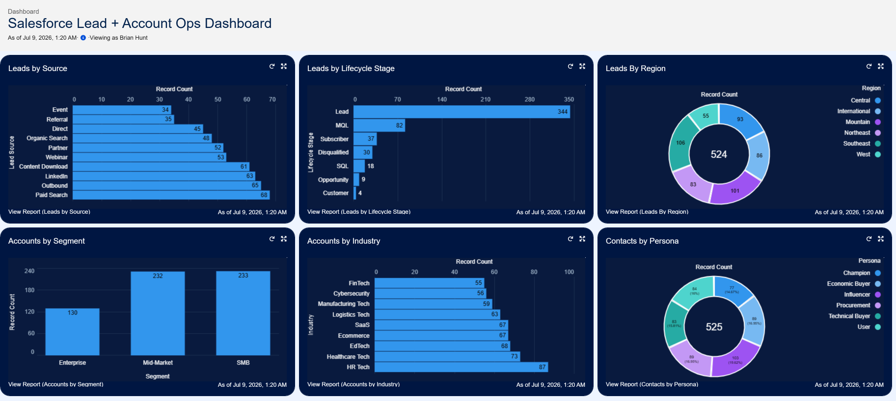
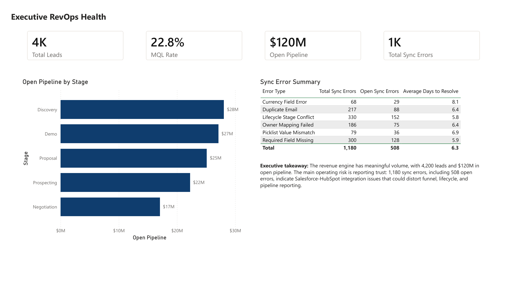
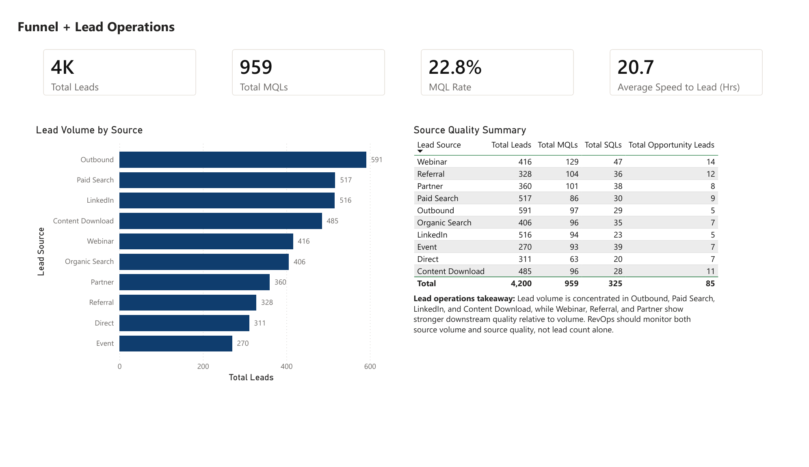
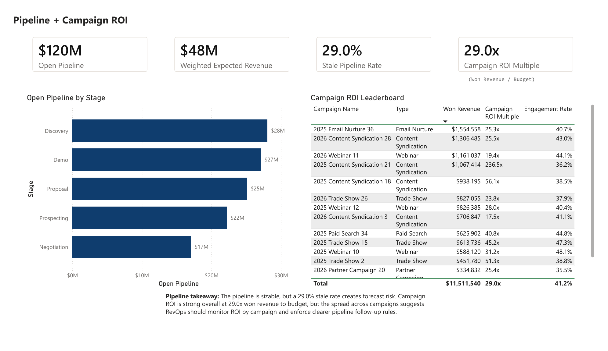
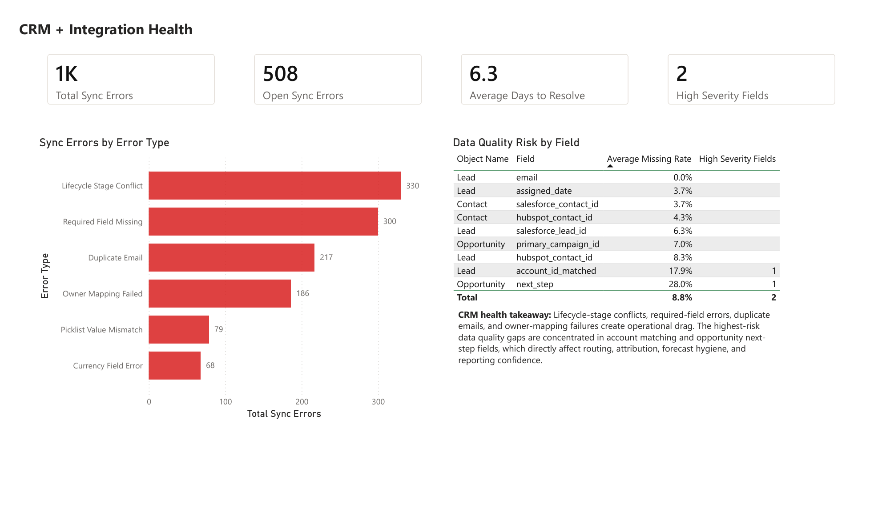

# Salesforce + HubSpot RevOps Health Dashboard

Synthetic Revenue Operations mini-project showing how Salesforce, HubSpot, SQL/Python, and Power BI can be used together to diagnose CRM health, lifecycle conversion, pipeline hygiene, and marketing attribution.

The project is built around a synthetic B2B company that uses HubSpot for marketing automation and Salesforce for sales execution. The dataset intentionally includes realistic RevOps issues: sync errors, lifecycle gaps, duplicate risk, stale opportunities, missing IDs, inconsistent follow-up SLAs, and field ownership conflicts.

## Dashboard previews

### Salesforce dashboard



### HubSpot dashboard

[Open the HubSpot dashboard](https://app-na2.hubspot.com/reports-dashboard/246675740/view/140531384)

Note: this link may require access to the authenticated HubSpot account where the dashboard was created.

### Power BI dashboard PDF

[Open the Power BI PDF export](dashboards/powerbi/Salesforce_HubSpot_RevOps_Health_Dashboard_Final.pdf)









## What is included

- Full synthetic Salesforce + HubSpot source dataset with CSV exports and a SQLite database.
- Randomized, smaller upload package for free Salesforce and HubSpot accounts.
- Salesforce dashboard screenshot for lead, account, contact, region, source, and lifecycle reporting.
- HubSpot dashboard reference link.
- Power BI dashboard file, exported PDF, and rendered PDF preview images.
- Dashboard-ready CSV outputs, starter SQL, starter Python, and Plotly HTML visuals.

## Repository layout

```text
data/
  full_dataset/                     Full synthetic source CSVs, SQLite DB, manifest, mappings
  dashboard_ready/                  Aggregated dashboard extracts
  import_samples/randomized/        Smaller randomized upload package for free CRM accounts
dashboards/
  powerbi/                          Final PBIX, PDF export, and older PBIX versions
  salesforce/                       Salesforce dashboard screenshot
  hubspot/                          HubSpot dashboard reference
docs/                               Source README, dashboard links, notes
notebooks/                          Data creation / visualization notebook
scripts/                            Starter Python analysis
sql/                                Starter SQL queries
visuals/plotly/                     Interactive HTML visualizations
```

## Randomized upload samples

The folder `data/import_samples/randomized/` is the CRM-ready subset. It is intentionally smaller than the full dataset so it can be uploaded into free/developer Salesforce and HubSpot accounts.

Randomization seed: `20260704`

- Salesforce sample: 900 leads, 900 contacts, 500 opportunities, 595 related accounts, all 36 campaigns, plus optional/reference task, campaign member, sync error, and data quality audit imports.
- HubSpot sample: 417 companies, 900 deduped contacts, optional deals, campaign reference, and marketing activity summary.
- Import guidance: see `data/import_samples/randomized/README_IMPORT_STRATEGY.md`.
- File-purpose mapping: see `data/import_samples/randomized/system_file_mapping.csv`.

## Dashboard assets

- Power BI report: `dashboards/powerbi/Salesforce_HubSpot_RevOps_Health_Dashboard_Final.pbix`
- Power BI PDF export: `dashboards/powerbi/Salesforce_HubSpot_RevOps_Health_Dashboard_Final.pdf`
- Salesforce screenshot: `dashboards/salesforce/Salesforce_Lead_Account_Ops_Dashboard.png`
- HubSpot dashboard: `https://app-na2.hubspot.com/reports-dashboard/246675740/view/140531384`

The HubSpot link may require access to the authenticated HubSpot account where the dashboard was built.

## Data scope

The full dataset covers `2025-01-01` through `2026-06-30` and includes:

- 4,200 Salesforce leads
- 3,600 Salesforce contacts
- 1,650 Salesforce opportunities
- 14,500 Salesforce tasks
- 5,200 HubSpot form submissions
- 24,000 HubSpot email events
- 1,180 sync error records
- Data dictionary, field mapping, and data quality audit outputs

## Run the starter analysis

```powershell
python scripts/starter_analysis.py
```

The script reads `data/full_dataset/revops_salesforce_hubspot.db`, prints funnel/pipeline/sync-health summaries, and writes quick chart PNGs to `visuals/generated/`.

## Portfolio framing

This project demonstrates how a RevOps analyst or consultant can:

- Model cross-system Salesforce and HubSpot data.
- Build upload-ready CRM samples for sandbox/free accounts.
- Diagnose CRM hygiene and integration health.
- Translate operational findings into executive dashboard assets.
- Package the work so a stakeholder can inspect the data, analysis logic, and dashboards.

All data is synthetic and does not contain real customer or prospect information.

